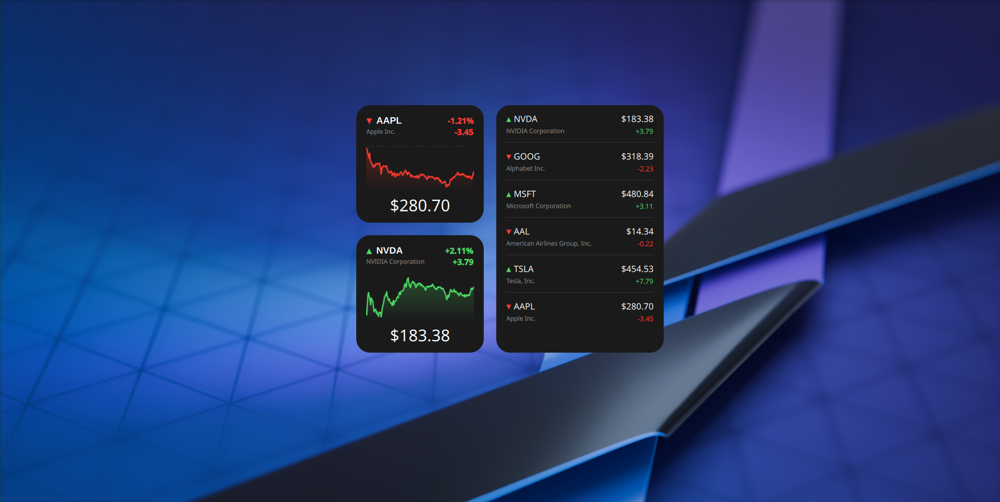
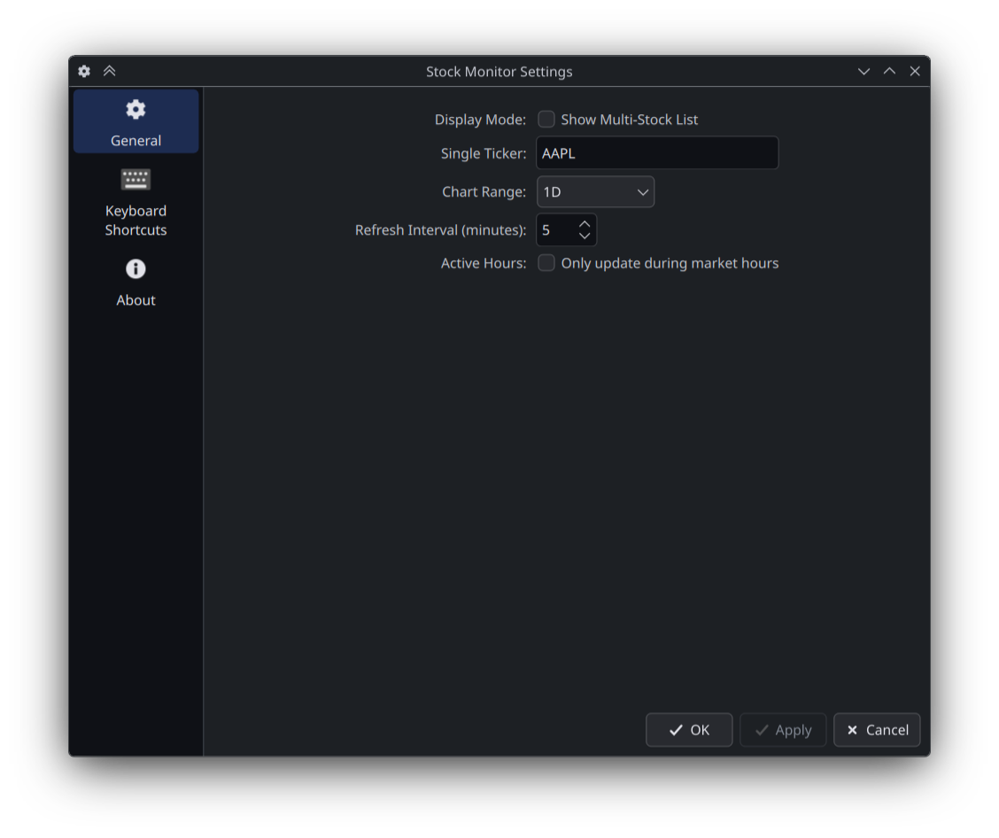
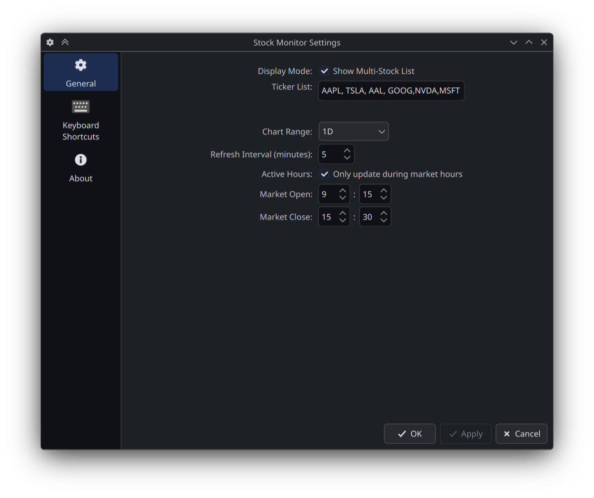

# Stock Market Monitor for KDE Plasma 6

This is a clean, modern stock market widget I built for KDE Plasma 6.

I wanted something that looked as good as the stock widgets on mobile phones—dark mode, smooth gradients, and easy to read—but right on my Linux desktop. It pulls data directly from Yahoo Finance, so you get coverage for stocks, crypto, and currencies from all over the world.

## ✨ Features

  * **Two Display Modes:**
      * **Single View:** Focus on one specific stock with a large price display, detailed chart, and company name.
      * **Multi-Stock List:** A compact list of multiple stocks to see trends at a glance.
  * **Beautiful Charts:** Smooth, gradient-filled charts that change color (Green/Red) based on performance.
  * **Data Ranges:** View history from 1 Day (1D) all the way up to 5 Years (5Y) or Max.
  * **Smart & Efficient:**
      * Automatic "Previous Close" dashed line.
      * **Battery Saver:** Option to stop updating when the market is closed.
      * Weekend detection logic.

## ⚙️ Configuration Options

You can right-click the widget and hit **"Configure..."** to tweak almost everything. Here is what you can change:

### 1\. General Settings

  * **Display Mode:** Toggle between showing one big stock or a list of many.
  * **Single Ticker:** If you are in Single Mode, type the symbol here (e.g., `AAPL`, `BTC-USD`, `GOOG`).
  * **Ticker List:** If you are in Multi-Mode, enter a comma-separated list here (e.g., `TSLA, MSFT, GOOG`).
  * **Data Range:** Choose the data range for stocks (`1D`, `5D`, `1M`, `6M`, `YTD`, `1Y`, `5Y`, `Max`).

### 2\. Updates & Interval

  * **Refresh Interval:** How often the data updates (in Minutes). Default is 5 minutes.

### 3\. Active Hours (Battery Saver)

  * **Only update during market hours:** Check this to prevent the widget from waking up your network when the stock market is closed.
  * **Market Open/Close:** Set the start and end time (e.g., 09:15 to 15:30) matching your local stock exchange time.

## 📦 How to Install

### From KDE Store

  * Right-click Desktop -\> **Add Widgets**.
  * Click **"Get New Widgets"**.
  * Search for "Stock Monitor" and hit Install.

