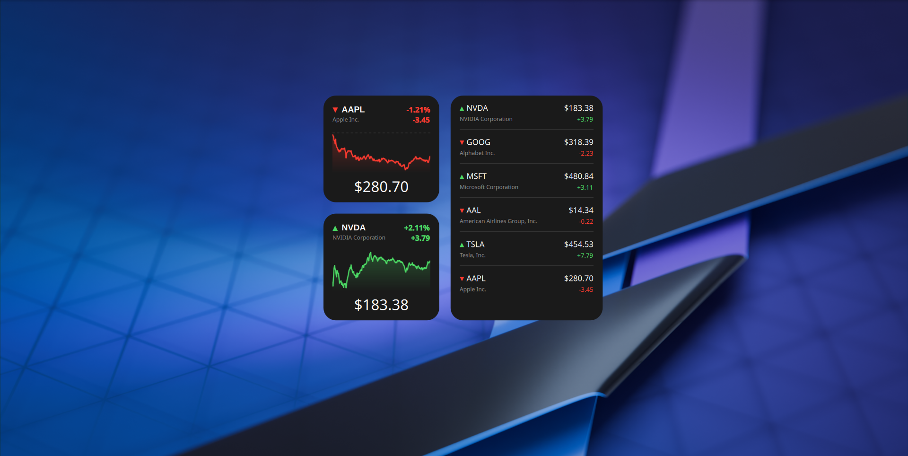
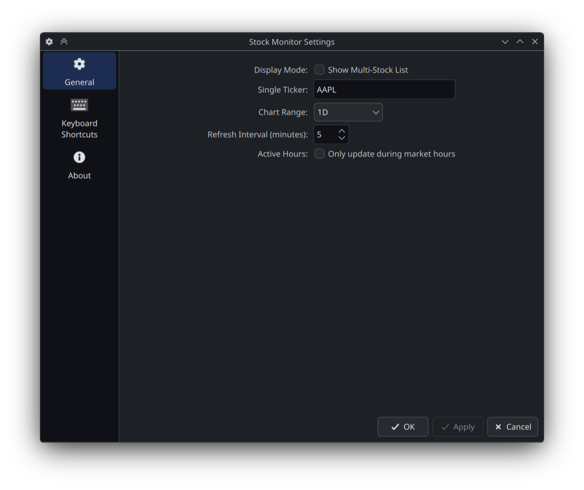
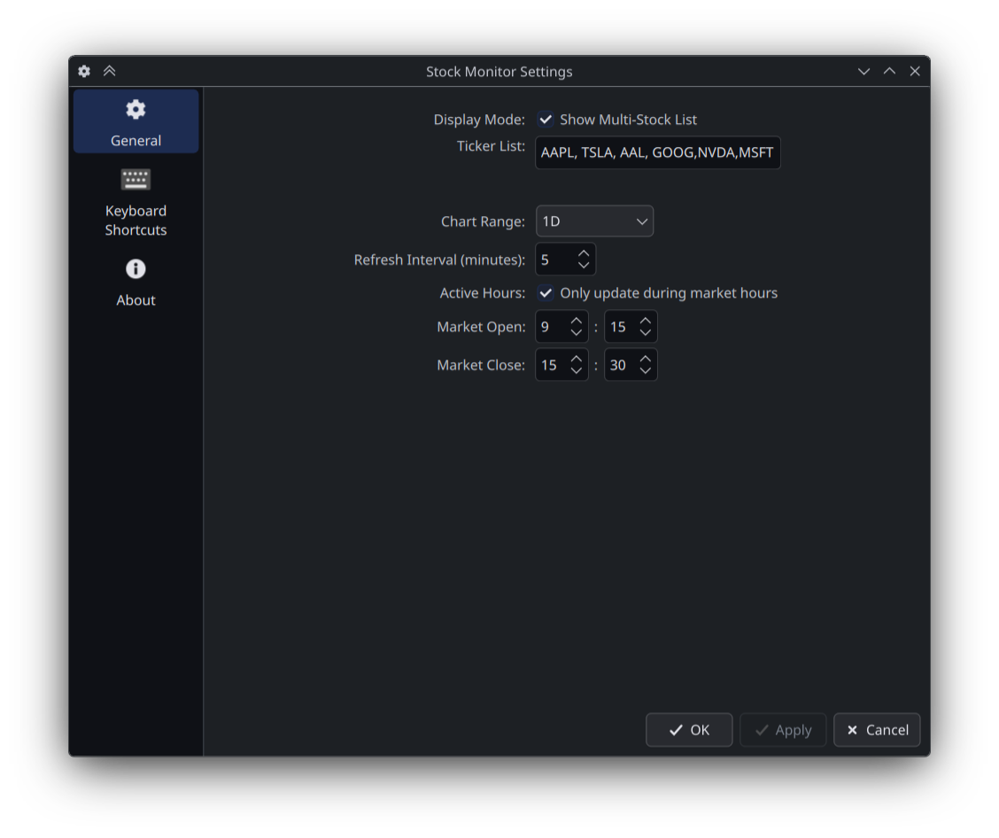

# Stock Market Monitor for KDE Plasma 6

This is a clean, modern stock market widget for KDE Plasma 6. It pulls data directly from Yahoo Finance, covering stocks, crypto, and currencies worldwide.

<p align="center">
    <a href="https://www.pling.com/p/2332661/">
        
    </a>
    <a href="https://ko-fi.com/vsh07">
        
    </a>
</p>



## ✨ Latest Enhancements

- **Yahoo Finance Integration:** Real-time data for stocks, crypto, indices, and currencies worldwide.
- **Portfolio View:** Track your holdings with profit/loss calculations and cost basis management.
- **Multi-Currency Support:** Automatically convert portfolio holdings to your preferred base currency (USD, EUR, GBP, JPY, CNY, INR) with live FX rates.
- **Custom Colors & Modern UI:** Beautiful charts with customizable gain/loss colors and sleek badge design.

## 🚀 Features

- **Two Display Modes:** Single stock view or multi-stock list.
- **Real-Time Charts:** Live price data from Yahoo Finance with historical ranges (1D to 5Y).
- **Portfolio Tracking:** Monitor cost basis, shares, and P/L with multi-currency support.
- **Smart Updates:** Battery-saver mode to skip updates during market hours.
- **Customizable:** Colors, refresh rates, and market hours all configurable.

## 🔍 How to Find Ticker Symbols

This widget uses **Yahoo Finance**, so search [finance.yahoo.com](https://finance.yahoo.com) for any ticker.

**Examples:**
- **US Stocks:** `AAPL`, `TSLA`, `MSFT`
- **Crypto:** `BTC-USD`, `ETH-USD`
- **Indices:** `^GSPC` (S&P 500), `^NSEI` (Nifty 50)
- **Currencies:** `EURUSD=X`, `GBPUSD=X`

## ⚙️ Configuration

### General Settings
- **Display Mode:** Single stock or multi-stock list
- **Ticker(s):** Single ticker (e.g., `AAPL`) or comma-separated list (e.g., `AAPL, MSFT, GOOG`)
- **Data Range:** Choose from 1D, 5D, 1M, 6M, YTD, 1Y, 5Y, Max
- **Base Currency:** Portfolio base currency (USD, EUR, GBP, JPY, CNY, INR) — all holdings auto-convert
- **Refresh Interval:** Update frequency in minutes (default: 5)
- **Battery Saver:** Only update during market hours

### Portfolio Mode
- Enable portfolio tracking to see cost basis, shares, and P/L
- Add holdings manually or import/export Yahoo Finance CSV
- Multi-currency portfolios automatically convert to your chosen base currency




## 📊 Portfolio CSV Import

### Export from Yahoo Finance
1. Go to [finance.yahoo.com](https://finance.yahoo.com)
2. Find your portfolio list and download it as CSV
3. Use the Portfolio settings → **"Import Yahoo CSV"** button to load it here

### CSV Requirements
The CSV must include:
- **Symbol** (ticker symbol)
- **Quantity** (shares held)
- **Purchase Price** (cost per share)

Optional: Commission, Trade Date, Transaction Type (only BUY transactions imported).

**Example:**
```csv
Symbol,Quantity,Purchase Price
AAPL,100,150.25
EURUSD=X,1000,1.0850
BTC-USD,0.5,45000.00
```

Invalid rows or missing required columns are skipped silently.

## 📦 How to Install

### From KDE Store

- Right-click Desktop → **Add Widgets**.
- Click **"Get New Widgets"**.
- Search for "Stock Monitor" and hit Install.
